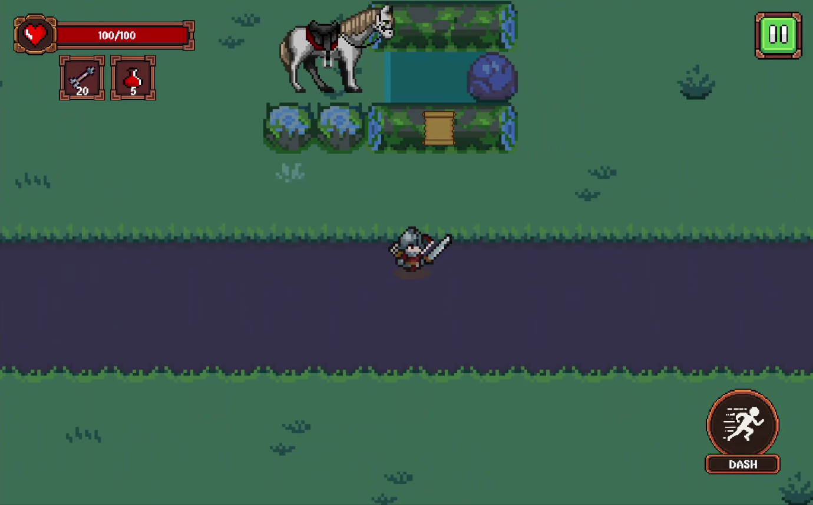
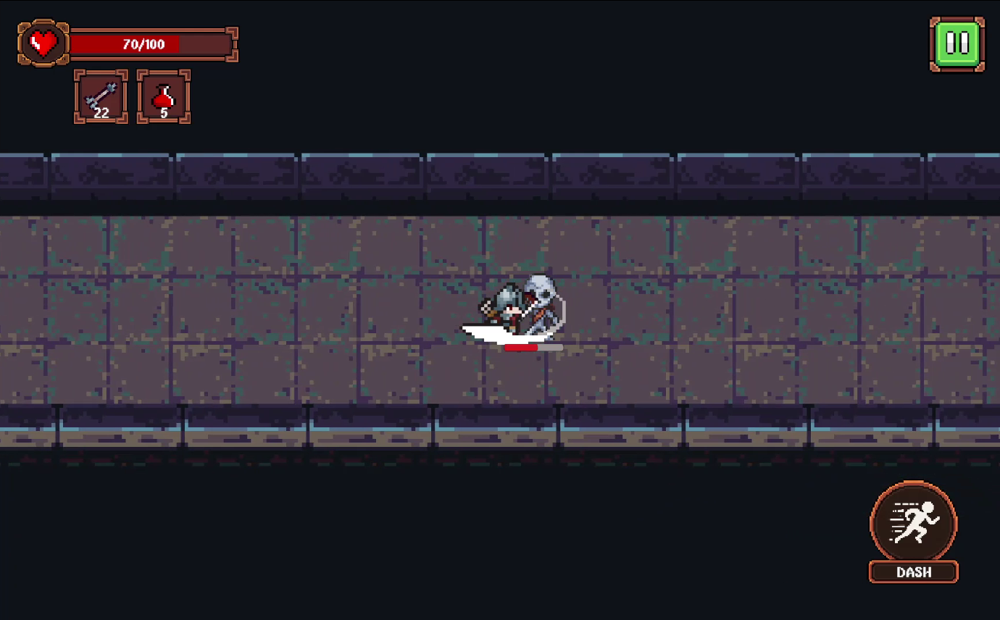
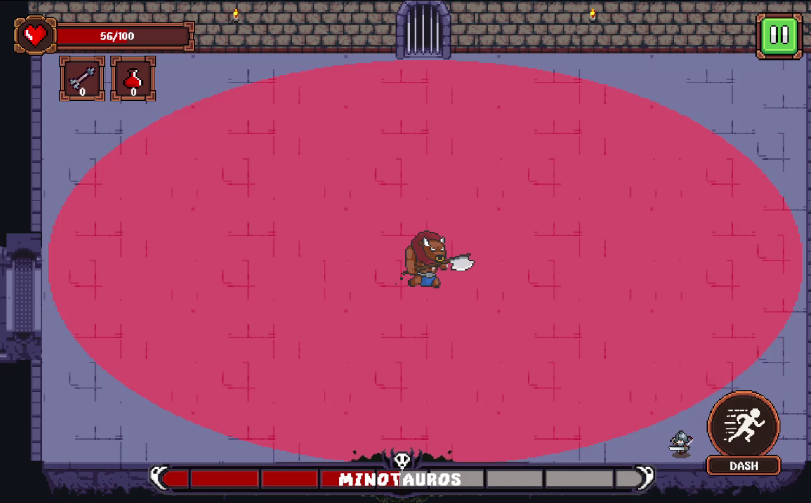

# The Hero Knight

A 2D action-adventure game developed with Unity, featuring exploration, combat, enemy encounters, character abilities, UI systems, visual effects, and multiple environments.

The project was created as a learning and portfolio project to practice and demonstrate game development skills, including gameplay programming, Unity development, game systems, UI implementation, animation, audio, and visual effects.

## 🎮 Game Overview

The Hero Knight puts the player in the role of a knight exploring dangerous environments while fighting monsters and overcoming various challenges.

The game focuses on simple and responsive action gameplay, with mechanics such as:

- Character movement
- Combat system
- Enemy encounters
- Health system
- Dash ability
- Enemy detection and attack behavior
- Player animation
- UI and HUD
- Multiple environments
- Visual effects
- Sound effects and background music
- Pause and game state systems
- Scene management

## 🛠️ Built With

- **Unity**
- **C#**
- **Unity UI**
- **Animator**
- **Particle System**
- **Audio System**
- **Unity Physics**
- **Git / GitHub**

## 🎯 Project Goals

The main goal of this project was to gain practical experience in developing a complete playable game from gameplay programming to presentation.

Throughout development, I worked on:

- Designing and implementing gameplay systems
- Programming player movement and abilities
- Creating enemy behaviors
- Building UI systems
- Implementing animations and visual effects
- Managing audio and sound effects
- Handling scenes and game states
- Debugging and improving gameplay issues
- Packaging and publishing the game

## 📸 Screenshots

### Gameplay







## 🎥 Gameplay Video

Gameplay showcase:

[Watch on YouTube](YOUR_YOUTUBE_LINK)

## 📦 Download

The latest playable Windows build is available in the **GitHub Releases** section.

You can also download the game from itch.io:

[Play / Download The Hero Knight](YOUR_ITCH_IO_LINK)

### Installation

1. Download the latest release ZIP.
2. Extract the ZIP file.
3. Open the extracted folder.
4. Run `TheHeroKnight.exe`.

No installation is required.

## 💻 Platform

- Windows

## 📁 Project Structure

```text
Assets/
├── Animations/
├── Audio/
├── Materials/
├── Models/
├── Prefabs/
├── Scenes/
├── Scripts/
├── Shaders/
├── UI/
└── VFX/
